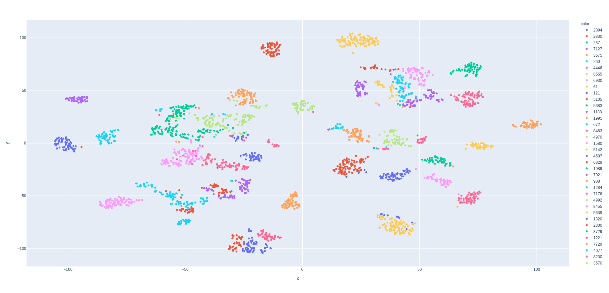

# quick-and-dirty-dl
Quick and dirty implementation of some of the SOTA deep learing models using Pytorch and Pytorch Lightning.

## cpc
Sampling method and implementation is heavily influenced by [facebook/cpc_audio](https://github.com/facebookresearch/CPC_audio) with modification and simplification (minimum implementation).

### Reference
- [facebook/cpc_audio](https://github.com/facebookresearch/CPC_audio)

### Training
300k steps; batch size 8; learning rate 2e-4 (refer to 'Representation learning with Contrastive Predictive Coding') 

### T-SNE visualization on test_clean of Librispeech

